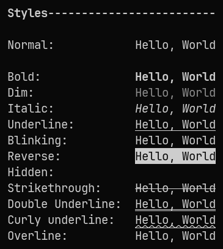
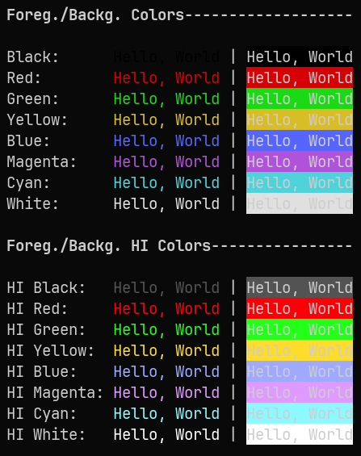
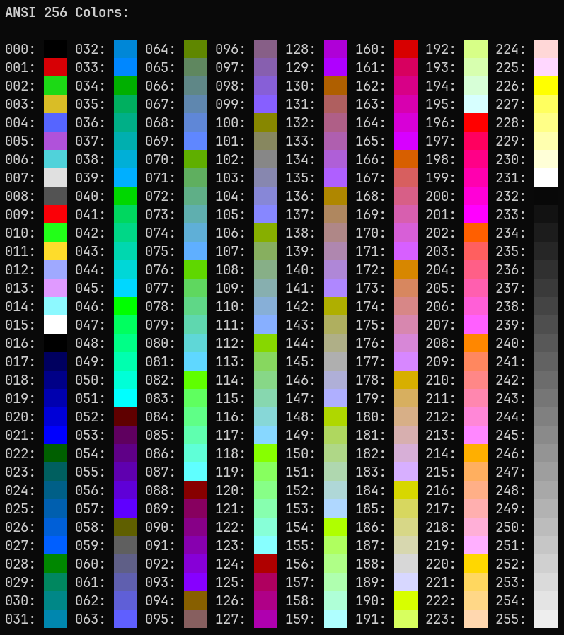
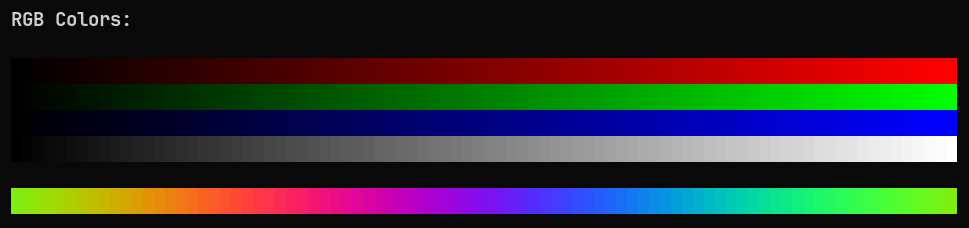

# Description
This header defines text style macros using ANSI escape codes with
SGR (Select Graphic Rendition) parameters.

> Just a utility I put together to help me with some exercises.

# Usage
 There are two ways to apply the styles and colors:

### 1. **Escape Code Macros (_E SUFFIX)**
Use the macros ending in `_E` before the string and a reset macro afterward when necessary.
  ```c
printf(BOLD_E FG_RED_E "Hello, World\n" RESET); // Results in bold red text.
  ```
  > Using a specific reset macro such as RESET_BOLD resets only the indicated one. See [**Notes**.](#reset-macros)
### 2. **Function Macros (Concise)**
Use the function-like macros to style text, which automatically apply and reset styles.
  ```c
printf(BOLD(FG_RED("Hello, World\n"))); // Results in the same bold red text.
  ```

# Styles
### Macros:
BOLD, DIM, ITALIC, UNDERLINE, BLINKING, REVERSE, HIDDEN, STRIKETHROUGH, DOUBLE_UNDERLINE,
CURLY_UNDERLINE, OVERLINE

⚠️: _Not all terminals support all styles_

> This and the next screenshots were taken in the [ghostty](https://ghostty.org/) terminal emulator with the "deep" theme.



*Output of example01.c*

# Colors
### Basic Macros:
* FG_BLACK, FG_RED, FG_GREEN, FG_YELLOW, FG_BLUE, FG_MAGENTA, FG_CYAN, FG_WHITE
* BG_BLACK, BG_RED, BG_GREEN, BG_YELLOW, BG_BLUE, BG_MAGENTA, BG_CYAN, BG_WHITE
### High Intensity Color Macros:
* FG_HI_BLACK, FG_HI_RED, FG_HI_GREEN, FG_HI_YELLOW, FG_HI_BLUE, FG_HI_MAGENTA, FG_HI_CYAN, FG_HI_WHITE
* BG_HI_BLACK, BG_HI_RED, BG_HI_GREEN, BG_HI_YELLOW, BG_HI_BLUE, BG_HI_MAGENTA, BG_HI_CYAN, BG_HI_WHITE



*Output of example02.c*

## ANSI 256 colors
  Use the `A256_FG` or `A256_BG` macros to apply colors in a range of 0-255 color indexes.
  ```c
  printf(A256_FG(21, "Hello, World\n")); // Results in dark blue text.
  ```
  For use with formatted variables, pass the format specifier **WITHOUT QUOTES**.
  ```c
  printf(A256_FG(%d, "Hello, World\n"), n);
  ```



*Output of example03.c*

## RGB Colors
  Modern terminals also support 24-bit RGB. Use the `RGB_FG` or `RGB_BG` macros to apply colors.
  ```c
  printf(RGB_FG(255, 126, 0, "Hello, World\n")); // Results in orange text.
  ```
  Same as ANSI macros for formatting.
  ```c
  printf(RGB_FG(%d, %d, 0, "Hello, World\n"), r, g);
  ```



*Output of example04.c*

# Notes
## Reset Macros
If you decide to use the first method, you will need to manually reset the style and/or color.
For this, there are RESET macros.

The main one, simply RESET, completely resets the styles and colors. The others specifically
reset the target style, such as RESET_BOLD and RESET_CURLY_UNDERLINE.

However, **pay attention** to the BOLD and DIM styles, and the UNDERLINE and DOUBLE_UNDERLINE
styles, as these are reset with the same escape codes. In other words, resetting one
resets the other associated with it.

# References
  * ANSI Escape Sequences: https://gist.github.com/fnky/458719343aabd01cfb17a3a4f7296797
  * Formating Text in Linux Terminals: https://www.baeldung.com/linux/formatting-text-in-terminals
  * The entire table of ANSI color codes working in C!: https://gist.github.com/RabaDabaDoba/145049536f815903c79944599c6f952a
